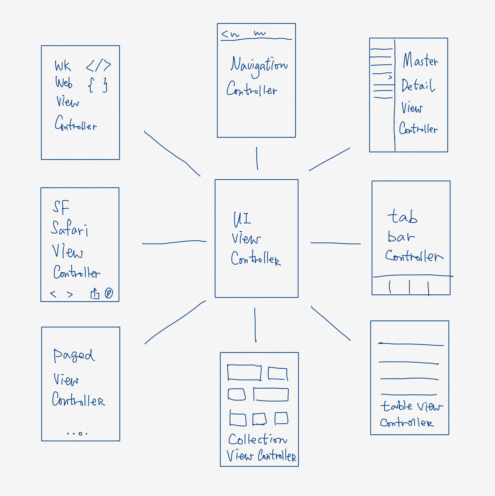

# View Controllers in iOS

There are different view controllers in iOS. 

## Single View

The view controller for displaying one screen. 

### UIViewController

- Generic blank view.
- Need AutoLayout for the entire screen.

### UITableViewController

- List view in iOS.
- Cell Sections and rows

### UICollectionViewController

- Similar to table view, but in grid-like view.

## Multiple Views

The following `UINavigationController ` and `UITabBarController ` manage multiple view controllers. 

### UINavigationController

- Relationship segue between view controllers.
- Navigation Item for each embedded view controller.
- Auto use previous title in back button on top-left.
- Allow swipe to go back gesture.
- Push and pop view controllers.
- `prepare(for segue)` to configure the next view controller.

### UITabBarController

- Tab bar at the bottom with at most 5 icons.
- View controllers are managed in array.
- Fifth button becomes “More” when there are more than 5 view controllers.